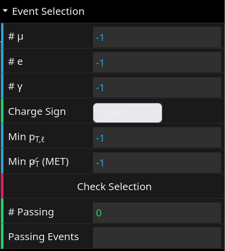

<link rel="stylesheet" href="https://cdnjs.cloudflare.com/ajax/libs/font-awesome/5.15.4/css/all.min.css">

# iSpy WebGL (Masterclasses @ DESY)

Dieses Repository enthält eine modifizierte Version des iSpy WebGL Event Displays, welches für die Masterclasses am DESY angepasst wurde. Die ursprüngliche Version des iSpy WebGL Event Displays wurde von der CMS Kollaboration (Mitwirkende: [F. Ali](https://github.com/9inpachi), [L. Barnard](https://github.com/lukebarnard), [M. Hategan](https://github.com/hategan), [S. Lee](https://github.com/SeungJunLee0), [C. Logrén](https://github.com/carpppa), [T. McCauley](https://github.com/tpmccauley), [P. Nguyen](https://github.com/phongn), [M. Saunby](https://github.com/msaunby)) entwickelt und ist unter folgende Links verfügbar:

Production Version: [https://cern.ch/ispy-webgl](https://cern.ch/ispy-webgl)

Publication: [T McCauley 2017 J. Phys.: Conf. Ser. 898 072030](https://doi.org/10.1088/1742-6596/898/7/072030)

## Was ist iSpy WebGL?

iSpy WebGL ist ein browserbasiertes Event Display für das CMS Experiment am LHC. Es ermöglicht die Visualisierung von Ereignisdaten, die von den [iSpy Analyzers](https://github.com/cms-outreach/ispy-analyzers)

</img>

## Erste Schritte

### Öffnen von Files

Über das Menü "Open File" <i class="fa fa-folder-open" style="border: 1px solid black; padding: 6px; display: inline-block;"></i> können Events geöffnet werden. Es gibt zwei Möglichkeiten, Events zu öffnen:

1. **Open local file(s)**: Hier kann eine Datei aus dem lokalen Dateisystem aus ausgewählt werden. Die Datei muss im [.ig](https://github.com/cms-outreach/ispy-analyzers) Format vorliegen.

2. **Open file(s) from the Web**: Hier kann aus bereitgestellten Beispielen für verschiedene Prozesse ausgewählt werden.

### Navigation zwischen Events

Nachdem ein file geöffnet wurde, können durch die Events dieses files navigieren, indem die Pfeiltasten Ihres Tastatures <i class="fa fa-arrow-left" style="border: 1px solid black; padding: 6px; display: inline-block;"></i> <i class="fa fa-arrow-right" style="border: 1px solid black; padding: 6px; display: inline-block;"></i> oder die Knöpfe <i class="fa fa-step-backward" style="border: 1px solid black; padding: 6px; display: inline-block;"></i> <i class="fa fa-step-forward" style="border: 1px solid black; padding: 6px; display: inline-block;"></i> aus der oberen Leiste verwenden werden.

### Ansichten wechseln

Ein Event kann in verschiedenen Ansichten dargestellt werden. Die Ansichten können über die Knöpfe 3D, r&phi; oder &rho;z aus der oberen Leiste gewechselt werden. Um auf die Anfangsansicht zurückzukehren, kann auf den Knopf <i class="fa fa-home" style="border: 1px solid black; padding: 6px; display: inline-block;"></i> geklickt werden.

In der 3D Ansicht lässt sich das Event auch entlang einer Achse anzeigen. Dazu können die Knöpfe ,   und  verwenden werden. Dies kann bei der Bestimmun der Teilchenladung und die Beobachtung der Spurkrümmung hilfreich sein.

### Detektor Elemente ein- und ausblenden

Unter dem Reiter "Detector" in der Kontrollleiste auf der rechten Seite, können die verschiedenen Detektorelemente (in abstrahierter Form) ein- und ausblenden werden. Die Detektorelemente sind in verschiedene Gruppen unterteilt, die über die Dropdown-Liste auswählen werden können. Dafür muss die Checkbox "show" unter der jeweiligen Gruppe aktiviert werden.

Eine "reelle" Ansicht der CMS Detektorteile kann aber auch angezeigt werden. Dafür muss das Modell des jeweiligen Teils über den Knopf "Import 3D Model" <i class="fa fa-download" style="border: 1px solid black; padding: 6px; display: inline-block;"></i> und danach "import file(s) from the Web" importiert werden. Zu Bachten ist jedoch, dass die 3D Modelle in einigen Fällen sehr groß sein können und die Darstellung des Events verlangsamen können.
Durch neuladen der Seite, können alle importierten Modelle wieder entfernt werden.

### Eventobjecte ein- und ausblenden

Die Teilchenspuren in einem geladenen Event können über die Checkboxen unter dem Reiter "Show/Hide" in der Kontrollleiste auf der rechten Seite ein- und ausgeblendet werden. Um diese Einstellung beim Wechseln zwischen Events beizubehalten, kann die Checkbox "Keep settings" aktiviert werden.

Bestimmte Informationen yum Events bzw. zu den Teilchen können über die Checkboxen unter dem Reiter "Event Info" ein- und ausgeblendet werden. Z.B. kann das pT und die Ladung von Elektronen und Muonen durch das Aktivieren der Checkboxen "Track Info" beim rüberfahren über die Spur angezeigt werden.

### Anwenden von Schnitten

Aktuell können Schnitte auf das pT und ET angewendet werden und dabei nur die Spuren anzeigen, die diese Schnitte erfüllen. Dazu können die Schieberegler unter dem Reiter "Momentum Cuts" verwenden werden. Die Schieberegler können auch durch das Eingeben von Werten in das Textfeld geändert werden. 

!!! note
    Die Schnitte dienen nur der Visualisierung und haben keinen Einfluss auf auf die spätere Selection der Events.

### Invariantenmasse berechnen

Spuren von Muonen und Elektronen können durch das Draufklicken selektiert werden und die Invariantenmasse dieser Teilchen kann durch das Drücken von m auf der Tastatur berechnet werden. Die Invariantenmasse wird in einem Popup-Fenster angezeigt. Die anzahl der Selektierten Spuren, kann unter dem Reiter "Event Info" eingesehen werden.

## Die Selektion und Analyse von Events

### Selektionschnitte auf einem bestimmten Event Testen

</img>

Unter dem Reiter "Event Selection" können die Schnitte auf die verschiedenen Teilchenvariablen anwenden. Wie im Bild zu sehen, sind 3 unterschiedliche Arten von Schnitten möglich:

1. **Teilchenanzahl**: Die kann auf Muonen, Elektronen und Photonen und Jets angewendet werden. Die Anzahl ist dabei eine positive ganze Zahl, womit nur Events mit exakter Übereinstimmung der Anzahl an Teilchen selektiert werden. Wird im Feld "-1" eingegeben, wird dieser Schnitt ignoriert und diese Teilchen fließen weder in die Selektion noch in der Berechnung der Invariantenmasse ein.

2. **Charge Sign**: Hier kann ausgewählt werden, ob bei jeweils einer Teilchengruppe es sich um Teilchen-Antiteilchen Paare handelt (Ladungssumme ergibt dabei 0) oder es sich um Teilchen bzw. Antiteilchen handelt. Die Auswahlmöglichkeiten sind "{leer}", "Same" und "Opposite". Bei "" wird dieser Schnitt ignoriert und die Selektion wird nicht auf die Ladung der Teilchen angewendet.

3. **Impuls**: Hier kann den Mindestimpuls sowohl für die Leptonen (Muonen und Elektronen) als auch für das MET ausgewählt werden. Die Einheit ist GeV und durch die Eingabe von "-1" wird dieser Schnitt ignoriert.

Mit dem Knopf "Check Selection" wird die Selektion auf das aktuelle Event angewendet. Außerdem werden in den 2 drunterliegenden Feldern die Anzahl der Events im File, die diese Selektion erfüllen, sowie die Indizes der ersten 5 Events angezeigt.

### Plotten der Invarianten Masse

Nachdem eine Selektion eingestellt ist, kann über den Analyse-Knopf <i class="fa fa-chart-bar" style="border: 1px solid black; padding: 6px; display: inline-block;"></i> die Invariantenmasse der selektierten Events geplottet werden. Der Plot wird in einem Popup-Fenster unter dem Tab "Invariant Mass" angezeigt. Die eingeflossenen Daten in den Plot könne als CSV-Datei durch den Knopf unter dem Plot heruntergeladen werden.

## Papers und talks

["WebGL and three.js in CMS"](https://tpmccauley.github.io/cms-webgl-cwp/#/) at the HEP Software Foundation Visualization Workshop, March 2017.

["iSpy WebGL: a browser-based event display for CMS using WebGL"](https://indico.cern.ch/event/570249/contributions/2450053/subcontributions/218722/attachments/1401904/2139981/mccauley-ispywebgl-hsf.pdf) at HEP Software Foundation Visualization Workshop, Jan 2017.

"A browser-based event display for the CMS Experiment at the LHC using WebGL", at CHEP 2016.
[paper](https://doi.org/10.1088/1742-6596/898/7/072030), [slides](https://indico.cern.ch/event/505613/contributions/2228350/attachments/1346680/2045130/Oral-v4-449.pdf), [highlight summary slide](https://indico.cern.ch/event/505613/contributions/2228350/attachments/1346680/2030787/Highlights-v0-449.pdf)